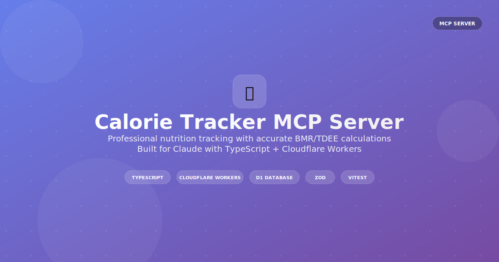

# Calorie Tracker MCP Server



MCP server for tracking daily calorie intake with accurate BMR/TDEE calculations. Built on Cloudflare Workers with D1 database.

## Features

- **Food Tracking**: Add, update, delete food entries with macros
- **Profile Management**: BMR/TDEE calculations using Harris-Benedict equation
- **Historical Data**: Track weight, body composition over time  
- **Secure**: API key authentication with role-based access

## Quick Setup

```bash
pnpm install
npx wrangler d1 create calorie-tracker
npx wrangler d1 migrations apply calorie-tracker
pnpm run dev
```

Update `wrangler.jsonc` with your database ID.

## Claude Desktop Config

```json
{
  "mcpServers": {
    "calorie-tracker": {
      "command": "npx", 
      "args": ["mcp-remote", "http://localhost:8787/sse"],
      "env": {
        "BEARER_TOKEN": "YOUR_ADMIN_API_KEY"
      }
    }
  }
}
```

## Tools

**Food Tracking:**

- `list_entries` - List food entries with pagination
- `add_entry` - Add food entry with macros
- `update_entry` - Update existing entry
- `delete_entry` - Delete entry

**Profile Management:**

- `get_profile` - Get profile with BMR/TDEE calculations
- `update_profile` - Update profile data (height, weight, activity level)
- `get_profile_history` - Historical tracking data

**Admin:**

- `register_user` - Register new user
- `revoke_user` - Revoke user access

## BMR/TDEE Calculations

Uses Harris-Benedict equation (1984 revision):

**Male:** `BMR = 88.362 + (13.397 × weight) + (4.799 × height) - (5.677 × age)`  
**Female:** `BMR = 447.593 + (9.247 × weight) + (3.098 × height) - (4.330 × age)`

**TDEE:** `BMR × Activity Multiplier` (1.2 - 1.9)

## Development

```bash
pnpm test              # Run tests
pnpm run deploy        # Deploy to production
pnpm run type-check    # TypeScript validation
```

## Tech Stack

- **Runtime**: Cloudflare Workers
- **Database**: D1 (SQLite)
- **Language**: TypeScript
- **Validation**: Zod
- **Testing**: Vitest
